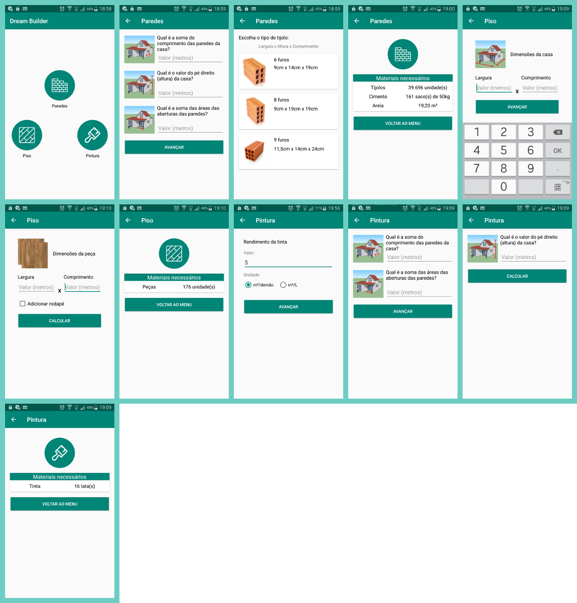

# Dream Builder

## About the project
Dream Builder was created to help architects, engineers and non-technical people
to better estimate the amount of supplies needed to build a house or any other type
of building. It enables the users to reduce material waste and save time.

## How to run
1) Clone the repository
2) Import the project to Android Studio or IntellijIDEA
3) Update dependencies and/or gradle version if necessary
4) Build the APK
5) Profit! (Install it in your device) :D

## Contributing
Pull requests are welcome!

## License
Read about license rights and limitations [here](LICENSE).
